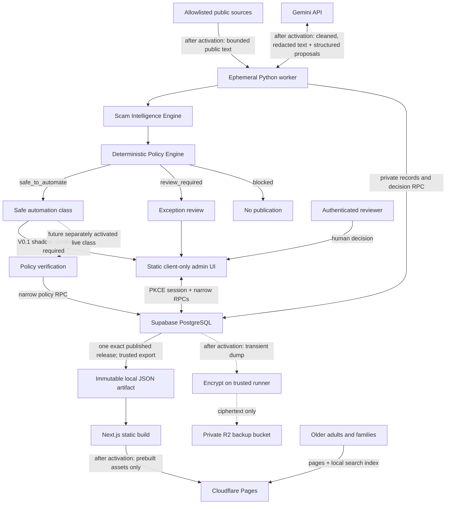

# Scam Radar V0.1 architecture

**Status:** Offline implementation architecture, updated 2026-09-10. External collection, Gemini, production Supabase, encrypted R2 backup, Cloudflare deployment, DNS, and telemetry are not activated.

## Outcome and non-negotiable invariants

Scam Radar compresses selected trustworthy public reports into an evidence-backed searchable memory of **Scam Patterns**. A deterministic Policy Engine handles routine safe classes and sends only exceptions to a human decision queue. Articles are evidence; they are not public records by themselves.

The architecture protects six invariants:

1. **Hot ≠ true.** Deterministic Scam Heat ranks attention. The Evidence Gate controls supportable wording.
2. **AI ≠ authority.** AI proposes. Evidence plus versioned deterministic policy decide whether automation is allowed; model confidence can only make the result more conservative.
3. **Verification ≠ release inclusion ≠ deployment.** Policy or human verification authorizes an immutable revision; `published_at` freezes it into a public-release manifest; only deployment makes that artifact visible to users.
4. **One release everywhere.** Home, detail routes, and local search come from the same exact `release_id`.
5. **Failure preserves the last trusted site.** Collection, AI, database, build, or bookkeeping failure cannot mutate an already deployed static artifact.
6. **Freshness ≠ workflow time.** Evidence verification, revision verification, and release publication are separate timestamps. Public “Last Verified” uses the oldest supporting evidence check.

## System context



No component runs continuously. The public path is static and does not require Supabase, Gemini, or the worker at request time.

V0.1 therefore uses Supabase Free rather than paying for database uptime that the public request path does not need. Before accepting production data, a separately activated encrypted off-site backup must close the free plan's managed-backup gap. Cloudflare Pages Free is the intended static host; current quotas are launch checks rather than architectural guarantees.

## Component responsibilities

| Component | Owns | Must not own |
|---|---|---|
| `config/` | Reviewed Source Registry, taxonomy, model selection, deterministic score, and publication-policy configuration | Runtime source health or secrets |
| `worker/` | Discover/fetch/normalize, dedup, AI proposals, matching candidates, Evidence Gate, Heat, deterministic policy decisions, exception routing, release export adapter | Human exception decisions, public request serving, permanent raw HTML |
| `supabase/` | Forward-only schema, private records, RLS/grants, append-only policy/human provenance, transactional verification/release RPCs, immutable/audit triggers | Crawling, model calls, mutable public pages |
| `web/` | Static public UI, same-release local search, client-only exception-review UI | Public runtime database reads, SSR, secret-bearing build code |
| `contracts/schemas/` | Versioned provider-neutral machine contracts | Provider SDK objects as product contracts |
| `prompts/` | Provider-neutral prompt prose | Model-specific patches or untested behavior changes |
| `evals/` | Gold Set, recorded responses, expected outputs, behavior reports | Production data dumps or secrets |
| `work/` | Disposable namespaced run/release artifacts | Any durable state |

## Batch and intelligence architecture

The Python CLI is a stage pipeline with typed boundaries and injectable transports:

```text
registry validation
  → lease/run record
  → discover/fetch/normalize
  → URL + content + origin dedup
  → relevance proposal
  → structured extraction proposal
  → deterministic candidate retrieval
  → constrained pattern comparison proposal
  → evidence-family proposal
  → Evidence Gate
  → deterministic Heat snapshot
  → versioned deterministic Policy Engine
       ├─ safe_to_automate → shadow record (V0.1: human confirmation)
       ├─ review_required → deduplicated exception Review Queue item
       └─ blocked → no publication path
```

Collectors stop at normalized source-item versions; they do not call AI or publish. Each stage caches by immutable content plus behavior hash. Re-running identical input produces no new logical item, AI artifact, evidence link, or open review task.

GitHub Actions now supports an IANA `timezone` on `schedule`, so collection will use three `Asia/Shanghai` entries away from minute zero. GitHub explicitly treats schedules as best-effort and may delay/drop them; persisted backlog and manual dispatch are required. This is not a real-time alert system.

## Data architecture

PostgreSQL is the private system of record. Stable identities (`source_items`, `scam_patterns`) point to immutable content versions (`source_item_versions`, verified `pattern_revisions`). Relational claim-support mappings connect every public factual value to accepted evidence and a bounded span. Evidence families prevent copied reporting from counting as independent corroboration.

The Policy Engine reads explicit candidate facts and reviewed configuration. It emits a version/hash, input/candidate hashes, outcome, reason codes, shadow state, and whether publication authority was actually granted. It never reads free-form model prose. Model confidence is consulted only after a candidate already satisfies the deterministic safe class, and can only downgrade it to `review_required`.

Database protection is layered:

- explicit grants plus RLS on exposed objects;
- no anonymous data plane;
- enabled `admin_users` authorization in human exception RPCs;
- mandatory Policy Decision provenance for the human exception RPC, with legacy direct approval RPCs revoked;
- append-only `policy_decisions` with separate policy and human provenance;
- a narrow policy verification RPC that rejects shadow decisions and remains activation-gated off in V0.1; a later activation must bind the exact approved policy version/hash and Evidence Gate version, never a free-standing boolean;
- optimistic `row_version` checks;
- trigger-enforced verified-revision/release immutability;
- append-only `review_events`; and
- reviewer identity checks independent of the worker's secret-key access.

Three timestamps never substitute for each other: `pattern_evidence.last_verified_at` records the source check, `pattern_revisions.verified_at` records policy/human verification, and `public_releases.published_at` records when the revision is frozen into an immutable public-release manifest. Cloudflare upload is a later deployment event recorded separately. Each release item pins the conservative minimum evidence verification time for claim-support mappings in that revision. Evidence can be rechecked after the revision decision, so the first two clocks have no required order; every exported verification timestamp must exist and be no later than the release freeze.

Supabase publishable keys are safe to expose only because RLS/grants remain the authorization boundary. Secret keys bypass RLS and therefore exist only in one trusted worker/export step. Function execution is explicitly revoked/granted; `security definer` is exceptional and uses an empty `search_path` plus fully qualified objects.

See [ADR-002](decisions/002-supabase-rls-immutable-releases.md) and [ADR-007](decisions/007-policy-engine-human-exception.md).

## Public release architecture

1. A policy or human transaction freezes one verified pattern revision and its exact evidence support. V0.1 shadow outcomes still use authenticated human confirmation.
2. `prepare_public_release()` copies the last deployed manifest, applies only authorized verified revisions or explicit unpublishes, and fixes `published_at` into the manifest hash.
3. The immutable manifest pins a revision, Heat snapshot, conservative pattern freshness, and per-evidence verification timestamps for every included pattern.
4. A secret-bearing exporter step writes `public-release.json` and `search-index.json` for that exact ID.
5. The secret is scoped to that step; the Next.js build process receives only JSON plus public build metadata.
6. `next build` generates all public routes with `generateStaticParams()` and `dynamicParams = false`.
7. After activation, CI uploads the same hashed static directory to preview, tests it, then uploads it to production.
8. Release schema v2 exposes public `last_verified_at` separately from `published_at`; it never relabels revision verification as evidence freshness.
9. The live `release.json` is authoritative for deployment reconciliation. A failed database record after upload does not make the already-public artifact disappear.

Public browsers never query Supabase for content and never transmit search text. The separately loaded admin chunks use Supabase Auth/RPCs after reviewer interaction.

See [ADR-001](decisions/001-nextjs-static-export.md) and [ADR-005](decisions/005-cloudflare-pages-direct-upload.md).

## AI boundary

`LLMProvider` is a narrow protocol; recorded/fake and Gemini implementations sit behind it. Production behavior is selected only by versioned repository files. Gemini structured output supports a subset of JSON Schema and syntactic structure does not establish semantic correctness, so the worker validates the result and preserves `unknown`/`null` rather than filling unsupported facts.

AI never establishes evidence level, final Heat, merge, policy eligibility, verification, or publication. High confidence grants nothing. Low or missing confidence may only route an otherwise safe policy candidate to a human. Embeddings remain disabled until measured lexical failures justify their privacy/cost/quality trade-off.

See [ADR-004](decisions/004-gemini-provider-boundary.md).

## Execution modes

| Mode | Allowed | Forbidden |
|---|---|---|
| Offline development (current) | Approved package registries during bootstrap, localhost, fixtures, recorded AI responses, local Supabase containers, static build | Real sources, Gemini, production Supabase, Cloudflare, DNS, telemetry |
| Shadow activation (later approval) | Explicitly approved/capped sources and Gemini, production persistence, policy shadow decisions, private exception review | Live automatic authorization, public deploy, or DNS unless separately enabled |
| Production (later launch approval) | Scheduled capped collection, Policy Engine shadow routing, human exception/confirmation, exact release Direct Upload | Live automatic authorization without a separate narrowly scoped activation, automatic paid fallback, whole-web crawling |

Kill switches independently stop collection, AI, and deployment. Disabling work never removes the last published static site.

## Known risks and validation gates

- **Mainland access:** Cloudflare Pages quality is an unresolved empirical risk. Validate multiple mainland mobile paths and WeChat before launch; do not distort the engine architecture in advance.
- **Cloudflare token scope:** official API token resources permit one-account + Pages permission, not documented per-project restriction. Resolve account isolation at activation; see ADR-005.
- **Free-tier/model change:** quotas and model IDs are configuration, not entitlement. Exhaustion queues work; it never triggers payment/provider fallback.
- **Free-tier database recovery:** Supabase Free has no downloadable automatic backups. Production activation requires encrypted off-site logical backups and a tested restore path; see ADR-008.
- **Static admin constraints:** PKCE callback and all auth states must work as browser-only flows, with clear loading/recovery states.
- **Two toolchains:** root `make` commands and pinned locks carry this complexity so Rui does not have to.
- **False accusation:** claim-level evidence, legal-status wording, deterministic policy constraints, authenticated exception decisions, unpublish release, and audit/eval regression are launch blockers, not later polish.

## Decision index

- [ADR-001: Next.js static export](decisions/001-nextjs-static-export.md)
- [ADR-002: Supabase RLS and immutable releases](decisions/002-supabase-rls-immutable-releases.md)
- [ADR-003: Python batch worker](decisions/003-python-batch-worker.md)
- [ADR-004: Gemini provider boundary](decisions/004-gemini-provider-boundary.md)
- [ADR-005: Cloudflare Pages Direct Upload](decisions/005-cloudflare-pages-direct-upload.md)
- [ADR-006: Dependency review](decisions/006-dependency-review.md)
- [ADR-007: Policy Engine with human exception review](decisions/007-policy-engine-human-exception.md)
- [ADR-008: Free-tier continuity with encrypted off-site backups](decisions/008-free-tier-continuity-and-encrypted-backups.md)
