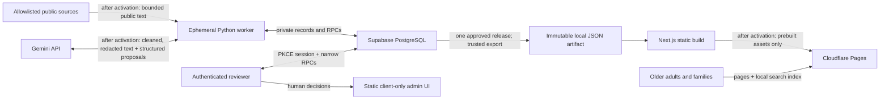

# Scam Radar V0.1 architecture

**Status:** Offline implementation architecture, 2026-08-16. External collection, Gemini, production Supabase, Cloudflare deployment, DNS, and telemetry are not activated.

## Outcome and non-negotiable invariants

Scam Radar compresses selected trustworthy public reports into a short human Review Queue and an evidence-backed searchable memory of **Scam Patterns**. Articles are evidence; they are not public records by themselves.

The architecture protects five invariants:

1. **Hot ≠ true.** Deterministic Scam Heat ranks attention. The Evidence Gate controls supportable wording.
2. **AI ≠ authority.** AI proposes; accepted evidence plus an authenticated human approve.
3. **Approval ≠ publication.** Approval prepares content for the next immutable release. The UI states whether it is actually public.
4. **One release everywhere.** Home, detail routes, and local search come from the same exact `release_id`.
5. **Failure preserves the last trusted site.** Collection, AI, database, build, or bookkeeping failure cannot mutate an already deployed static artifact.

## System context



No component runs continuously. The public path is static and does not require Supabase, Gemini, or the worker at request time.

## Component responsibilities

| Component | Owns | Must not own |
|---|---|---|
| `config/` | Reviewed Source Registry, taxonomy, model selection, and deterministic score configuration | Runtime source health or secrets |
| `worker/` | Discover/fetch/normalize, dedup, AI proposals, matching candidates, Evidence Gate, Heat, queue generation, release export adapter | Human approval, public request serving, permanent raw HTML |
| `supabase/` | Forward-only schema, private records, RLS/grants, transactional reviewer/release RPCs, immutable/audit triggers | Crawling, model calls, mutable public pages |
| `web/` | Static public UI, same-release local search, client-only reviewer UI | Public runtime database reads, SSR, secret-bearing build code |
| `contracts/schemas/` | Versioned provider-neutral machine contracts | Provider SDK objects as product contracts |
| `prompts/` | Provider-neutral prompt prose | Model-specific patches or untested behavior changes |
| `evals/` | Gold Set, recorded responses, expected outputs, behavior reports | Production data dumps or secrets |
| `work/` | Disposable namespaced run/release artifacts | Any durable state |

## Batch and intelligence architecture

The Python CLI is a stage pipeline with typed boundaries and injectable transports:

```text
registry validation
  → lease/run record
  → discover/fetch/normalize
  → URL + content + origin dedup
  → relevance proposal
  → structured extraction proposal
  → deterministic candidate retrieval
  → constrained pattern comparison proposal
  → evidence-family proposal
  → Evidence Gate
  → deterministic Heat snapshot
  → deduplicated Review Queue item
```

Collectors stop at normalized source-item versions; they do not call AI or publish. Each stage caches by immutable content plus behavior hash. Re-running identical input produces no new logical item, AI artifact, evidence link, or open review task.

GitHub Actions now supports an IANA `timezone` on `schedule`, so collection will use three `Asia/Shanghai` entries away from minute zero. GitHub explicitly treats schedules as best-effort and may delay/drop them; persisted backlog and manual dispatch are required. This is not a real-time alert system.

## Data architecture

PostgreSQL is the private system of record. Stable identities (`source_items`, `scam_patterns`) point to immutable content versions (`source_item_versions`, approved `pattern_revisions`). Relational claim-support mappings connect every public factual value to accepted evidence and a bounded span. Evidence families prevent copied reporting from counting as independent corroboration.

Database protection is layered:

- explicit grants plus RLS on exposed objects;
- no anonymous data plane;
- enabled `admin_users` authorization in reviewer RPCs;
- optimistic `row_version` checks;
- trigger-enforced approved-revision/release immutability;
- append-only `review_events`; and
- reviewer identity checks independent of the worker's secret-key access.

Supabase publishable keys are safe to expose only because RLS/grants remain the authorization boundary. Secret keys bypass RLS and therefore exist only in one trusted worker/export step. Function execution is explicitly revoked/granted; `security definer` is exceptional and uses an empty `search_path` plus fully qualified objects.

See [ADR-002](decisions/002-supabase-rls-immutable-releases.md).

## Public release architecture

1. A reviewer transaction freezes one approved pattern revision and its evidence support.
2. `prepare_public_release()` copies the last deployed manifest and applies only approved revisions or explicit unpublishes.
3. The immutable manifest pins a revision and Heat snapshot for every included pattern.
4. A secret-bearing exporter step writes `public-release.json` and `search-index.json` for that exact ID.
5. The secret is scoped to that step; the Next.js build process receives only JSON plus public build metadata.
6. `next build` generates all public routes with `generateStaticParams()` and `dynamicParams = false`.
7. After activation, CI uploads the same hashed static directory to preview, tests it, then uploads it to production.
8. The live `release.json` is authoritative for deployment reconciliation. A failed database record after upload does not make the already-public artifact disappear.

Public browsers never query Supabase for content and never transmit search text. The separately loaded admin chunks use Supabase Auth/RPCs after reviewer interaction.

See [ADR-001](decisions/001-nextjs-static-export.md) and [ADR-005](decisions/005-cloudflare-pages-direct-upload.md).

## AI boundary

`LLMProvider` is a narrow protocol; recorded/fake and Gemini implementations sit behind it. Production behavior is selected only by versioned repository files. Gemini structured output supports a subset of JSON Schema and syntactic structure does not establish semantic correctness, so the worker validates the result and preserves `unknown`/`null` rather than filling unsupported facts.

AI never establishes evidence level, final Heat, merge, approval, or publication. Embeddings remain disabled until measured lexical failures justify their privacy/cost/quality trade-off.

See [ADR-004](decisions/004-gemini-provider-boundary.md).

## Execution modes

| Mode | Allowed | Forbidden |
|---|---|---|
| Offline development (current) | Approved package registries during bootstrap, localhost, fixtures, recorded AI responses, local Supabase containers, static build | Real sources, Gemini, production Supabase, Cloudflare, DNS, telemetry |
| Shadow activation (later approval) | Explicitly approved/capped sources and Gemini, production persistence, private review | Public deploy or DNS unless separately enabled |
| Production (later launch approval) | Scheduled capped collection, human review, exact release Direct Upload | Unattended publication, automatic paid fallback, whole-web crawling |

Kill switches independently stop collection, AI, and deployment. Disabling work never removes the last approved static site.

## Known risks and validation gates

- **Mainland access:** Cloudflare Pages quality is an unresolved empirical risk. Validate multiple mainland mobile paths and WeChat before launch; do not distort the engine architecture in advance.
- **Cloudflare token scope:** official API token resources permit one-account + Pages permission, not documented per-project restriction. Resolve account isolation at activation; see ADR-005.
- **Free-tier/model change:** quotas and model IDs are configuration, not entitlement. Exhaustion queues work; it never triggers payment/provider fallback.
- **Static admin constraints:** PKCE callback and all auth states must work as browser-only flows, with clear loading/recovery states.
- **Two toolchains:** root `make` commands and pinned locks carry this complexity so Rui does not have to.
- **False accusation:** claim-level evidence, legal-status wording, authenticated approval, unpublish release, and audit/eval regression are launch blockers, not later polish.

## Decision index

- [ADR-001: Next.js static export](decisions/001-nextjs-static-export.md)
- [ADR-002: Supabase RLS and immutable releases](decisions/002-supabase-rls-immutable-releases.md)
- [ADR-003: Python batch worker](decisions/003-python-batch-worker.md)
- [ADR-004: Gemini provider boundary](decisions/004-gemini-provider-boundary.md)
- [ADR-005: Cloudflare Pages Direct Upload](decisions/005-cloudflare-pages-direct-upload.md)
- [ADR-006: Dependency review](decisions/006-dependency-review.md)
