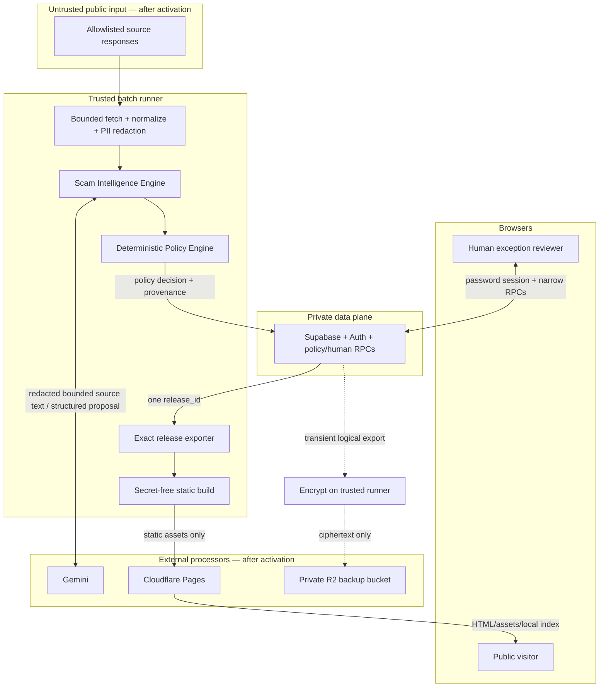
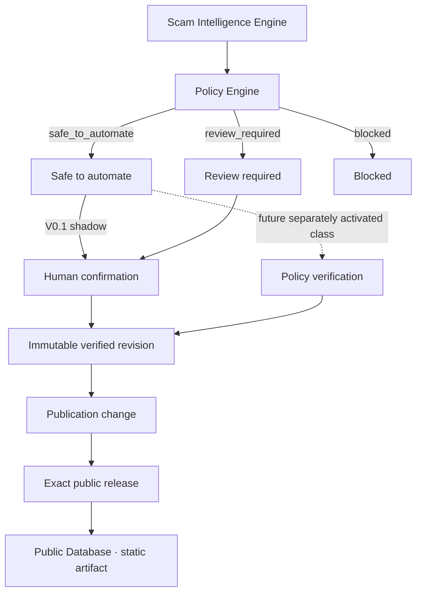
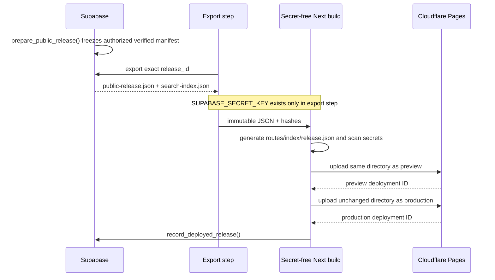

# Scam Radar V0.1 data flow

**Current state:** Application data remains fixture/local only. The empty Frankfurt Supabase foundation exists, and F4 reviewer Auth/RPC code is implemented and locally verified, but its forward migration and browser configuration are not deployed. The fixture-only Cloudflare preview paths F6/F7 are active; every live-data path remains disabled until its approved activation step.

## Trust zones



Source text is data, never instructions. External content cannot change prompt, model, taxonomy, score, source registry, gates, caps, or deployment settings.

## Flow inventory

| ID | From → to | Data | Purpose | Current status | Primary controls |
|---|---|---|---|---|---|
| F0 | Developer/CI → official npm/PyPI/container registries | Package names, versions, runner IP/timing | Approved bootstrap | Allowed | Pinned direct versions and committed locks; no application data |
| F1 | Actions runner → allowlisted public source | URL, reviewed request headers, runner IP/timing | Discover/fetch public pages | Disabled until activation | Source Registry, terms/robots review, per-host delay, timeout/retry/caps, kill switch |
| F2 | Runner → Gemini/Google | Prompt metadata plus bounded cleaned public-source text | Relevance, extraction, comparison proposal | Disabled until activation | PII redaction, no notes/secrets, char/call caps, provider switch, schema + semantic validation |
| F3 | Runner → Supabase | Source metadata/text, hashes, AI artifacts, evidence proposals, scores, policy decisions, exception/run state | Durable private state | Empty production schema provisioned; application writes disabled | Secret scoped to step, typed storage adapter, append-only decisions, TLS live, no body in logs |
| F4 | Reviewer browser → Supabase | Publishable key, login credentials/session metadata, narrow queue payload, evidence choices, exception action and decision note | Human exception decision or V0.1 shadow confirmation | Code and local contracts complete; production migration/config/deployment pending | RPC-only browser data access, enabled admin row, row version, transactional RPC, distinct human audit, unconfigured build fails closed |
| F5 | Exporter → Supabase | Exact `release_id` request | Read immutable published manifest | Local only | Secret-bearing step; verified-revision/release checks; no mutable “latest” query |
| F6 | Runner → Cloudflare Pages | Hashed compiled static directory | Preview/production publication | Fixture preview active; live-data production disabled | Manual deploy switch, protected Pages-only token, same-artifact smoke, no backend secret |
| F7 | Public browser → Cloudflare | Page/asset/search-index paths and ordinary network metadata | Serve public database | Fixture preview active at `preview.insparian-scam-radar.pages.dev`; no custom DNS | One immutable fixture release, visible test-data warning, `noindex`, no analytics/telemetry |
| F8 | Public browser local memory/CPU | User's search string and downloaded index | Exact/alias/keyword search | Fixture site only | Query never transmitted, logged, or retained by application |
| F9 | Supabase → trusted runner → private Cloudflare R2 | Transient private logical dump, then encrypted ciphertext plus integrity metadata | Off-site recovery for Supabase Free | Disabled until activation | Read-only export credential; encrypt before upload; offline recovery identity; private bucket; no GitHub artifact; restore rehearsal |

There is no source → browser path. Public copy is an original verified Scam Radar revision, not stored source HTML or an AI response.

## Collection and normalization

```text
registry source
  → discover references
  → fetch within byte/time/content-type limits
  → transient raw bytes
  → parse title/date/body
  → normalize URL and bounded clean text
  → compute raw/content hashes
  → discard raw HTML
  → insert stable source item + immutable version transactionally
```

- Do not persist HTML, arbitrary headers, screenshots, media, audio, binaries, or live malicious destinations.
- An unchanged content hash updates observation state without creating a version.
- A changed page creates a new immutable version and a supersession link; it never overwrites accepted evidence.
- Irrelevant clean text is nulled after classification unless a short reviewed fixture/audit exception exists. Metadata, URL, hashes, result, and timestamps remain for dedup/audit.
- Accepted relevant text remains private, bounded, and rechecked on policy schedule.

## Intelligence proposal flow

For each new source-item version:

1. Compute a relevance input hash from content and behavior versions.
2. Reuse an identical successful artifact or request a provider result (recorded offline; Gemini only after activation).
3. Validate JSON shape and domain values; one malformed retry is allowed live.
4. If relevant, extract fields with supporting spans; missing evidence stays `unknown`/`null`.
5. Retrieve at most configured `K` candidate pattern revisions deterministically.
6. Ask the provider only to compare those candidates. A model cannot merge them.
7. Propose origin/evidence families so syndication and one underlying case count once.
8. Run the deterministic Evidence Gate and Heat calculation independently.
9. Run the versioned deterministic Policy Engine and append `safe_to_automate`, `review_required`, or `blocked` with policy/input/candidate hashes and reason codes.
10. Route only exceptions to a deduplicated Review Queue. In V0.1 shadow mode, a safe candidate is also queued for human confirmation, but its recorded policy outcome remains safe-to-automate.

AI artifacts store provider, model, prompt/schema versions, input hash, status, bounded result/usage, latency, and reason/error codes. Logs do not contain the source body or full prompt.

## Policy routing and verification



The Policy Engine uses explicit typed facts plus `config/publication-policy-v0.1.yaml`. It does not ask a model whether publication is safe. High model confidence cannot remove a deterministic review reason. Low or missing relevance/pattern-match confidence is checked only for an otherwise-safe candidate and may downgrade it to review required.

Policy and human verification are atomic and have distinct provenance:

- `record_policy_decision` stores the immutable rules outcome, effective decision, mode, hashes, reason codes, and any one-way model-confidence downgrade.
- `confirm_policy_publication` requires `auth.uid()` plus an enabled admin and is the only usable V0.1 confirmation path.
- `apply_live_policy_publication` requires an eligible live policy decision, matching content/input hashes, and an exact database allowlist tuple of approved `policy_version + policy_hash + gate_version`. That allowlist is empty in V0.1; a boolean flag alone can never activate publication.
- Legacy direct approval RPCs are revoked from every API role; even an authenticated reviewer must arrive through a non-blocked Policy Decision and the exception RPC.

If actor/decision authority, stale version, Evidence Gate, required claim support, risk/legal wording, hash, or audit insertion fails, no verified revision is created. A generic worker credential cannot impersonate a reviewer, and a shadow decision cannot satisfy the future live policy transaction.

Reviewer notes and internal evidence spans stay private. Public output includes only verified summaries, minimal attribution, evidence links/wording, conservative information-freshness dates, release publication time, and Heat breakdown appropriate for users.

## Immutable publish flow



`prepare_public_release()` fixes `public_releases.published_at` when the revision becomes part of the immutable public-release manifest; that value is hashed into the artifact and never changes. It does **not** mean Cloudflare upload has succeeded. The production upload is the irreversible live-deployment point and is not enabled during offline work; `deployed_at` plus the deployment record capture that later event. If its final database record fails, reconciliation reads live `release.json` and retries the idempotent record; it does not rebuild or pretend nothing is public. If production smoke fails, deploy the last known-good artifact and record both deployment IDs.

Release schema v2 keeps time semantics separate:

- `pattern_evidence.last_verified_at`: actual evidence check time;
- `pattern_revisions.verified_at`: internal policy or human verification time;
- public `pattern.last_verified_at`: minimum verification time among evidence supporting the revision's claims; and
- `public_releases.published_at`: immutable public-release manifest freeze time; deployment has its own `deployed_at`.

Evidence may be rechecked after a revision decision, so evidence freshness is not required to precede `revision.verified_at`. Both clocks are independently required and must not be later than the release freeze.

## Data classification and retention

| Class | Examples | Storage/location | Retention rule |
|---|---|---|---|
| Public verified | Canonical pattern copy, evidence label/links, conservative last-verified date, release published-at, pinned Heat | Immutable release JSON and static assets | Indefinite versioned releases unless a reviewed retention decision changes this |
| Private source/evidence | Bounded relevant clean text, source metadata, spans, claim mappings | Supabase only | Preserve for traceability/recheck; never put in public artifact |
| Private decision | Drafts, notes, queue payloads, admin identities, policy decisions, human audit events | Supabase only | Policy/human audit append-only; corrections add events/revisions |
| Restricted credentials | Supabase secret, Gemini key, Cloudflare token, DB password | Local ignored env or scoped GitHub secret | Never committed/logged; rotate on suspected exposure |
| Encrypted recovery | Encrypted logical database exports and minimal integrity manifests | Private R2 bucket after activation | Retention/lifecycle policy must be approved at activation; never publicly accessible |
| Transient untrusted | Raw HTML/bytes and arbitrary response headers | Runner memory/temporary file only | Delete immediately after bounded normalization; never upload as artifact |
| Disposable build/test | Fixture run output and release staging | Namespaced `work/` | Re-creatable and ignored; safe cleanup only within the namespace |
| Prohibited | Victim PII, raw production dumps, malicious binaries, analytics identifiers | Nowhere | Do not collect or retain |

All database timestamps are UTC. Only the UI localizes them. Logs use IDs, hashes, counts, versions, timings, and reason codes—not source bodies, prompts containing source text, PII, tokens, or environment values.

## Failure and degraded behavior

- Source failure records a source result and leaves its cursor uncommitted; other sources can succeed.
- Gemini quota/failure leaves work `pending_ai`; prior public content remains unchanged.
- Evidence correction/withdrawal blocks automation and creates a `gate_regression` exception item; it never silently edits verified history.
- Database/lease/schema failure stops the run closed.
- Build/preview failure leaves production unchanged.
- Collection or AI kill switches do not block a separately approved urgent unpublish release.
- No-result public search says absence is not proof of safety and offers immediate protective actions.

## Activation checklist for data movement

Each external flow is activated independently. Before enabling any flow, Rui must review that flow's exact destination, outbound data, purpose, caps, credentials, stop control, and user impact. F1 requires the exact first five URLs and collection policies; F2 requires the bounded Google payload and call/character caps; F3 requires the Supabase region, worker credential, and data-location implications; F4 requires the reviewer credential/session/RPC boundary and a protected build/deploy path; F6–F7 require the Cloudflare account/token scope, artifact boundary, quota check, and resolved public access; F9 requires encrypted-backup recipient/recovery custody, retention, and a restore rehearsal; custom-domain activation requires the exact DNS change. Approval must be explicit, and approval for one flow grants no authority to another. Provisioning alone does not enable collection, AI, backup, deploy, DNS, or live policy authorization. Turning on `apply_live_policy_publication` is a separate decision after shadow-mode performance is measured for a narrowly defined class.

## Official platform references rechecked

- [Next.js static exports](https://nextjs.org/docs/app/guides/static-exports)
- [GitHub Actions schedules](https://docs.github.com/en/actions/reference/workflows-and-actions/events-that-trigger-workflows#schedule)
- [Supabase RLS](https://supabase.com/docs/guides/database/postgres/row-level-security)
- [Supabase functions](https://supabase.com/docs/guides/database/functions)
- [Supabase API keys](https://supabase.com/docs/guides/getting-started/api-keys)
- [Gemini structured outputs](https://ai.google.dev/gemini-api/docs/structured-output)
- [Cloudflare Direct Upload CI](https://developers.cloudflare.com/pages/how-to/use-direct-upload-with-continuous-integration/)
