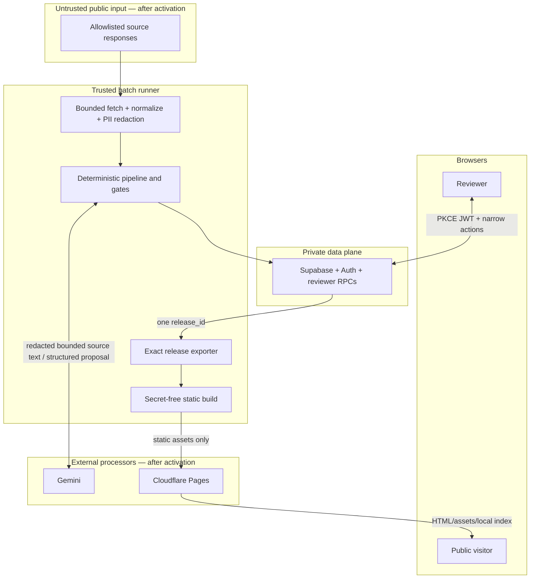
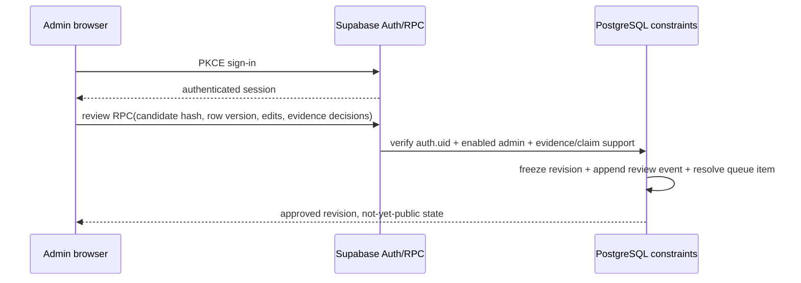
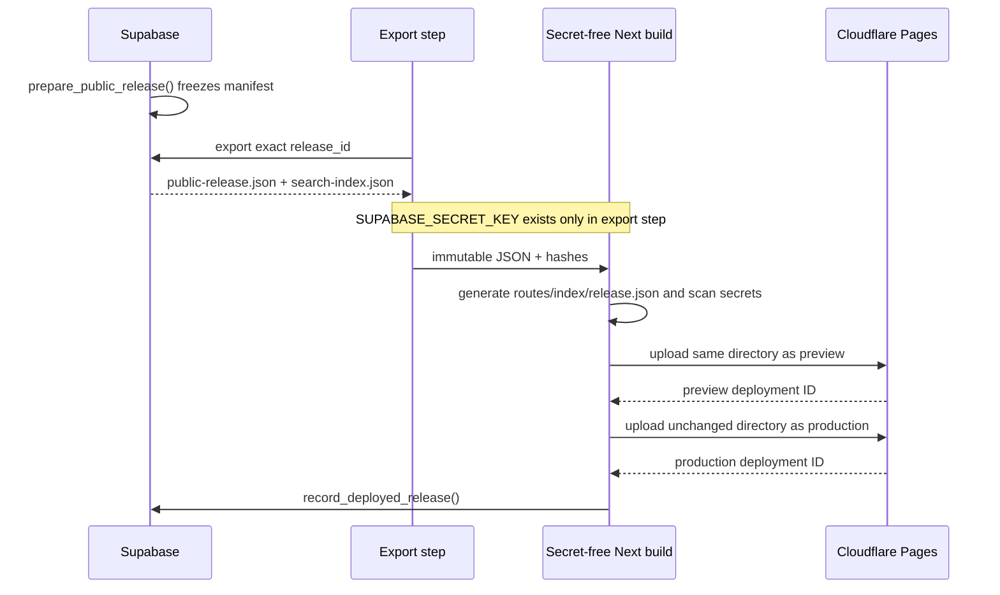

# Scam Radar V0.1 data flow

**Current state:** Every application flow is fixture/local only. Rows marked “after activation” describe intended production movement and require Rui's separate approval before the first live run.

## Trust zones



Source text is data, never instructions. External content cannot change prompt, model, taxonomy, score, source registry, gates, caps, or deployment settings.

## Flow inventory

| ID | From → to | Data | Purpose | Current status | Primary controls |
|---|---|---|---|---|---|
| F0 | Developer/CI → official npm/PyPI/container registries | Package names, versions, runner IP/timing | Approved bootstrap | Allowed | Pinned direct versions and committed locks; no application data |
| F1 | Actions runner → allowlisted public source | URL, reviewed request headers, runner IP/timing | Discover/fetch public pages | Disabled until activation | Source Registry, terms/robots review, per-host delay, timeout/retry/caps, kill switch |
| F2 | Runner → Gemini/Google | Prompt metadata plus bounded cleaned public-source text | Relevance, extraction, comparison proposal | Disabled until activation | PII redaction, no notes/secrets, char/call caps, provider switch, schema + semantic validation |
| F3 | Runner → Supabase | Source metadata/text, hashes, AI artifacts, evidence proposals, scores, queue/run state | Durable private state | Local containers only | Secret scoped to step, typed storage adapter, TLS live, no body in logs |
| F4 | Reviewer browser → Supabase | Publishable key, PKCE/Auth session, reads allowed by RLS, RPC action and decision note | Human review | Local fixture/auth only | RLS/grants, enabled admin row, row version, transactional RPC, audit event |
| F5 | Exporter → Supabase | Exact `release_id` request | Read immutable approved manifest | Local only | Secret-bearing step; release approval checks; no mutable “latest” query |
| F6 | Runner → Cloudflare Pages | Hashed compiled static directory | Preview/production publication | Disabled until launch approval | Deploy switch, Pages-only token permission, same-artifact smoke, no backend secret |
| F7 | Public browser → Cloudflare | Page/asset/search-index paths and ordinary network metadata | Serve public database | Not deployed | One immutable release; no analytics/telemetry |
| F8 | Public browser local memory/CPU | User's search string and downloaded index | Exact/alias/keyword search | Fixture site only | Query never transmitted, logged, or retained by application |

There is no source → browser path. Public copy is an original reviewed Scam Radar revision, not stored source HTML or an AI response.

## Collection and normalization

```text
registry source
  → discover references
  → fetch within byte/time/content-type limits
  → transient raw bytes
  → parse title/date/body
  → normalize URL and bounded clean text
  → compute raw/content hashes
  → discard raw HTML
  → insert stable source item + immutable version transactionally
```

- Do not persist HTML, arbitrary headers, screenshots, media, audio, binaries, or live malicious destinations.
- An unchanged content hash updates observation state without creating a version.
- A changed page creates a new immutable version and a supersession link; it never overwrites accepted evidence.
- Irrelevant clean text is nulled after classification unless a short reviewed fixture/audit exception exists. Metadata, URL, hashes, result, and timestamps remain for dedup/audit.
- Accepted relevant text remains private, bounded, and rechecked on policy schedule.

## Intelligence proposal flow

For each new source-item version:

1. Compute a relevance input hash from content and behavior versions.
2. Reuse an identical successful artifact or request a provider result (recorded offline; Gemini only after activation).
3. Validate JSON shape and domain values; one malformed retry is allowed live.
4. If relevant, extract fields with supporting spans; missing evidence stays `unknown`/`null`.
5. Retrieve at most configured `K` candidate pattern revisions deterministically.
6. Ask the provider only to compare those candidates. A model cannot merge them.
7. Propose origin/evidence families so syndication and one underlying case count once.
8. Run the deterministic Evidence Gate and Heat calculation independently.
9. Upsert one open review task by stable `dedupe_key`.

AI artifacts store provider, model, prompt/schema versions, input hash, status, bounded result/usage, latency, and reason/error codes. Logs do not contain the source body or full prompt.

## Human review and approval



Approval is atomic. If actor, stale-version, Evidence Gate, required claim support, risk/legal wording, or audit insertion fails, no approved revision is created. The worker credential alone has no human `auth.uid()` and cannot satisfy approval triggers.

Reviewer notes and internal evidence spans stay private. Public output includes only reviewed summaries, minimal attribution, evidence links, evidence wording, review dates, and Heat breakdown appropriate for users.

## Immutable publish flow



The production upload is the irreversible publication point and is not enabled during offline work. If its final database record fails, reconciliation reads live `release.json` and retries the idempotent record; it does not rebuild or pretend nothing is public. If production smoke fails, deploy the last known-good artifact and record both deployment IDs.

## Data classification and retention

| Class | Examples | Storage/location | Retention rule |
|---|---|---|---|
| Public reviewed | Canonical pattern copy, evidence label/links, review date, pinned Heat | Immutable release JSON and static assets | Indefinite versioned releases unless a reviewed retention decision changes this |
| Private source/evidence | Bounded relevant clean text, source metadata, spans, claim mappings | Supabase only | Preserve for traceability/recheck; never put in public artifact |
| Private editorial | Drafts, notes, queue payloads, admin identities, audit events | Supabase only | Audit append-only; corrections add events/revisions |
| Restricted credentials | Supabase secret, Gemini key, Cloudflare token, DB password | Local ignored env or scoped GitHub secret | Never committed/logged; rotate on suspected exposure |
| Transient untrusted | Raw HTML/bytes and arbitrary response headers | Runner memory/temporary file only | Delete immediately after bounded normalization; never upload as artifact |
| Disposable build/test | Fixture run output and release staging | Namespaced `work/` | Re-creatable and ignored; safe cleanup only within the namespace |
| Prohibited | Victim PII, raw production dumps, malicious binaries, analytics identifiers | Nowhere | Do not collect or retain |

All database timestamps are UTC. Only the UI localizes them. Logs use IDs, hashes, counts, versions, timings, and reason codes—not source bodies, prompts containing source text, PII, tokens, or environment values.

## Failure and degraded behavior

- Source failure records a source result and leaves its cursor uncommitted; other sources can succeed.
- Gemini quota/failure leaves work `pending_ai`; prior public content remains unchanged.
- Evidence correction/withdrawal creates a `gate_regression` review item; it never silently edits approved history.
- Database/lease/schema failure stops the run closed.
- Build/preview failure leaves production unchanged.
- Collection or AI kill switches do not block a separately approved urgent unpublish release.
- No-result public search says absence is not proof of safety and offers immediate protective actions.

## Activation checklist for data movement

Before enabling F1–F7, Rui must review the exact first five URLs and collection policies, Supabase region/data-location implications, bounded Google payload, free-tier caps, required secrets, reviewer identity, Cloudflare account/token scope, and domain change. Approval must be explicit; provisioning alone does not enable collection, AI, deploy, or DNS.

## Official platform references rechecked

- [Next.js static exports](https://nextjs.org/docs/app/guides/static-exports)
- [GitHub Actions schedules](https://docs.github.com/en/actions/reference/workflows-and-actions/events-that-trigger-workflows#schedule)
- [Supabase RLS](https://supabase.com/docs/guides/database/postgres/row-level-security)
- [Supabase functions](https://supabase.com/docs/guides/database/functions)
- [Supabase API keys](https://supabase.com/docs/guides/getting-started/api-keys)
- [Gemini structured outputs](https://ai.google.dev/gemini-api/docs/structured-output)
- [Cloudflare Direct Upload CI](https://developers.cloudflare.com/pages/how-to/use-direct-upload-with-continuous-integration/)
